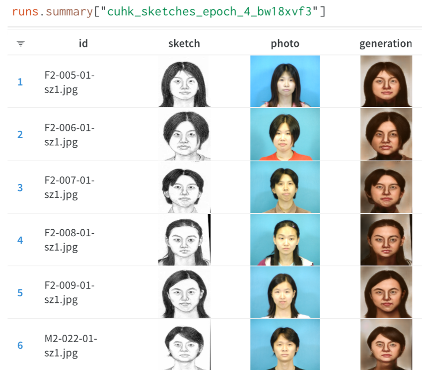
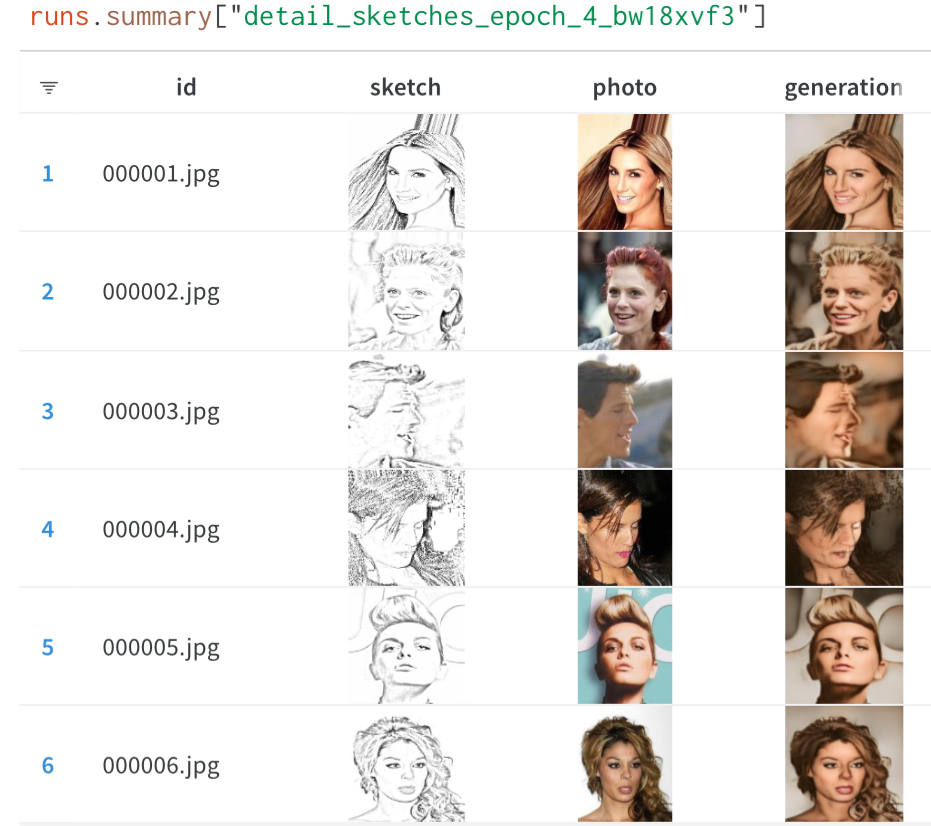

# Sketch to Photorealistic image transformations with Autoencoders

## Setup

To install the necessary dependencies for the project, you can use the requirements.txt file provided in the repository. Before proceeding with the installation, it is advisable to create and activate a virtual environment (virtualenv) as your working environment for the project. This ensures that the dependencies required for the project are installed in an isolated environment and do not interfere with globally installed package versions. Use the following command to install the dependencies:
```bash
pip install -r requirements.txt
```

## Usage guide

### wandb integration 

The project has been built with wandb integration for tracking experiments. So, make sure that you have a wandb account and an associated api key which you will need to enter when prompted, during the first run. You will just need to do it once.

### To train a model with your own dataset

The dataset must be in the form of two directories containing source and corresponding target images in their respective folders (It could be any dataset, not the sketch-photorealistic dataset necessarily). The directories can be placed in the 'model_input' directory of the repository, and edit the config.yaml file accordingly to reflect the path of the dataset properly. <br>
The training script by default is set to run a wandb sweep that can run the training loop with various sets of hyperparameters that are defined in the config file. You can add / remove the hyperparameters listed as desired.<br>
The trained models will be saved in the model_files directory of the repo.

The training script can then be executed with the following command:
```bash
python baseline_architecture.py
```

### Interactive notebook

Open the interactive_playground.ipynb python notebook with any supported application such as VSCode or Jupyter notebook, and set the python kernel to point to the virtualenv that you created for the project, or the global python binary that you use.

The notebook allows you to go through the entire pipeline that the data goes through, from transformations, to training the model, and using the model for inference.

## Sample outputs

The following outputs were from a model that was trained with 30k images, and only after 4 passes through the dataset which was synthetically generated using the dataset.py script and the CelebA-MaskHQ dataset.


